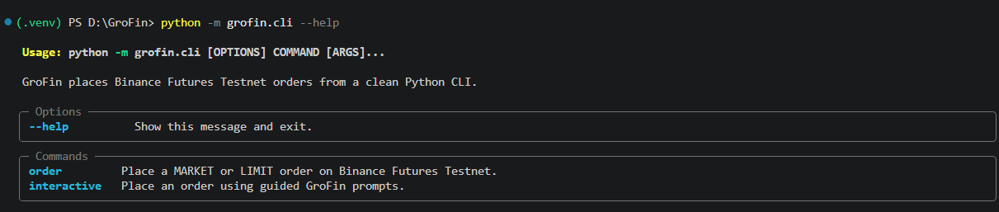
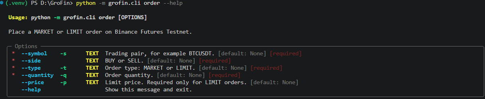
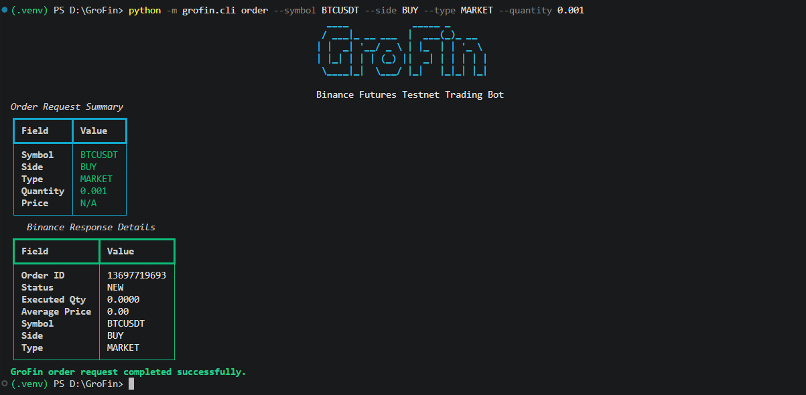
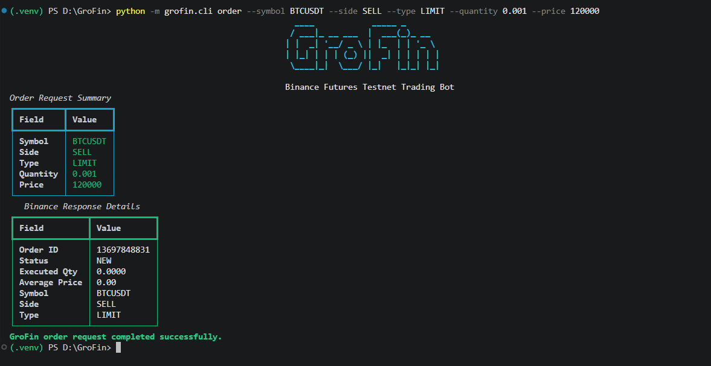
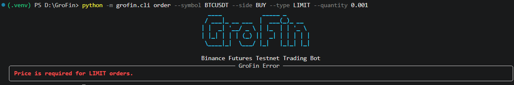
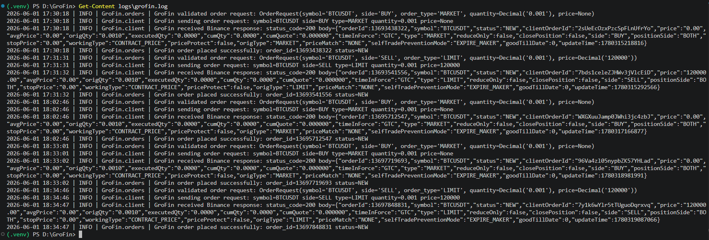

# GroFin

GroFin is a Python CLI trading bot for placing MARKET and LIMIT orders on Binance Futures Testnet USDT-M.

It is built with a clean project structure, professional validation, logging, error handling, and a polished Typer + Rich terminal experience.

## Features

- Places Binance Futures Testnet USDT-M MARKET orders
- Places Binance Futures Testnet USDT-M LIMIT orders
- Supports BUY and SELL sides
- Validates symbol, side, order type, quantity, and limit price
- Uses `.env` for Binance API credentials
- Logs to both terminal and `logs/grofin.log`
- Handles invalid input, Binance API errors, missing credentials, timeouts, and network failures
- Provides both command mode and interactive prompt mode
- Includes enhanced CLI UX with Rich tables, colors, panels, and guided prompts

## Project Structure

```text
GroFin/
├── grofin/
│   ├── cli.py
│   └── bot/
│       ├── __init__.py
│       ├── client.py
│       ├── logging_config.py
│       ├── orders.py
│       └── validators.py
├── .env.example
├── .gitignore
├── README.md
└── requirements.txt
```

## Tech Stack

- Python 3.x
- Typer for CLI commands
- Rich for formatted terminal output
- Requests for REST API calls
- python-dotenv for environment variables
- Python logging module for console and file logs

## Architecture

GroFin keeps each file focused on one responsibility:

- `grofin/bot/client.py` handles Binance Futures Testnet REST communication, request signing, API responses, and network failures.
- `grofin/bot/validators.py` validates and normalizes CLI input before any API request is made.
- `grofin/bot/orders.py` coordinates validation and order placement through a reusable order service.
- `grofin/bot/logging_config.py` configures console and rotating file logging for the whole application.
- `grofin/cli.py` provides the Typer command-line interface and Rich terminal output.

This separation makes the application easier to test, maintain, and extend.

## Setup

Open the project in VS Code:

```powershell
cd GroFin
code .
```

Create and activate a virtual environment:

```powershell
python -m venv .venv
.venv\Scripts\Activate.ps1
```

Install dependencies:

```powershell
pip install -r requirements.txt
```

Create your `.env` file:

```powershell
copy .env.example .env
```

Add your Binance Futures Testnet credentials to `.env`:

```env
BINANCE_API_KEY=your_testnet_api_key_here
BINANCE_API_SECRET=your_testnet_api_secret_here
```

Never commit `.env` to Git.

## Binance Futures Testnet

GroFin uses the Binance Futures Testnet base URL:

```text
https://testnet.binancefuture.com
```

You need a Binance Futures Testnet account and API credentials before placing real testnet orders.

## Usage

Run GroFin help:

```powershell
python -m grofin.cli --help
```

Place a MARKET order:

```powershell
python -m grofin.cli order --symbol BTCUSDT --side BUY --type MARKET --quantity 0.001
```

Place a LIMIT order:

```powershell
python -m grofin.cli order --symbol BTCUSDT --side SELL --type LIMIT --quantity 0.001 --price 70000
```

Use guided interactive mode:

```powershell
python -m grofin.cli interactive
```

Test validation for a missing LIMIT price:

```powershell
python -m grofin.cli order --symbol BTCUSDT --side BUY --type LIMIT --quantity 0.001
```

## Example Output

GroFin prints:

- Order request summary
- Binance response details
- Order ID
- Status
- Executed quantity
- Average price
- Success or failure message

## Screenshots

### CLI Help



### Order Command Help



### MARKET Order Success



### LIMIT Order Success



### Validation Error



### Log File



## Logging

GroFin writes logs to:

```text
logs/grofin.log
```

Logs include:

- Validated order requests
- Binance API request details
- Binance API response bodies
- API errors
- Network failures
- Unexpected CLI failures

Log files rotate automatically after they reach about 1 MB.

For review or demonstration, include a sanitized log file showing at least one successful MARKET order and one successful LIMIT order.

## Error Handling

GroFin handles:

- Missing Binance API credentials
- Invalid symbols
- Invalid BUY/SELL side
- Invalid MARKET/LIMIT type
- Missing LIMIT price
- Price passed to MARKET orders
- Invalid quantity or price values
- Binance API errors
- Request timeouts
- Network failures

## Assumptions

- GroFin is built for Binance Futures Testnet USDT-M only.
- Binance API credentials are loaded from a local `.env` file and are never hardcoded.
- LIMIT orders use `GTC` as `timeInForce`, meaning Good Till Cancelled.
- MARKET order execution behavior depends on Binance Futures Testnet liquidity and may return `NEW` before execution details are updated.
- Quantity and price values are handled using Python `Decimal` to avoid floating-point precision issues.

## Project Highlights

GroFin demonstrates:

- Python fundamentals
- REST API integration
- CLI design
- Binance Futures Testnet order placement
- Clean code structure
- Validation
- Logging
- Error handling
